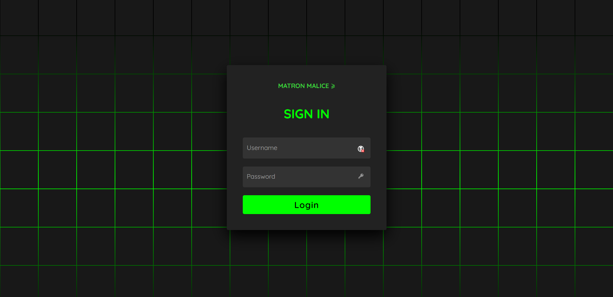
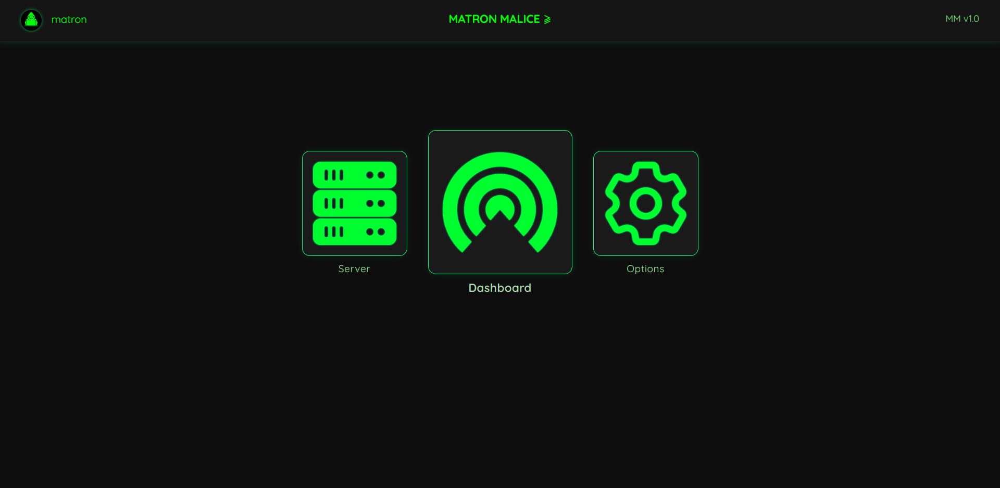
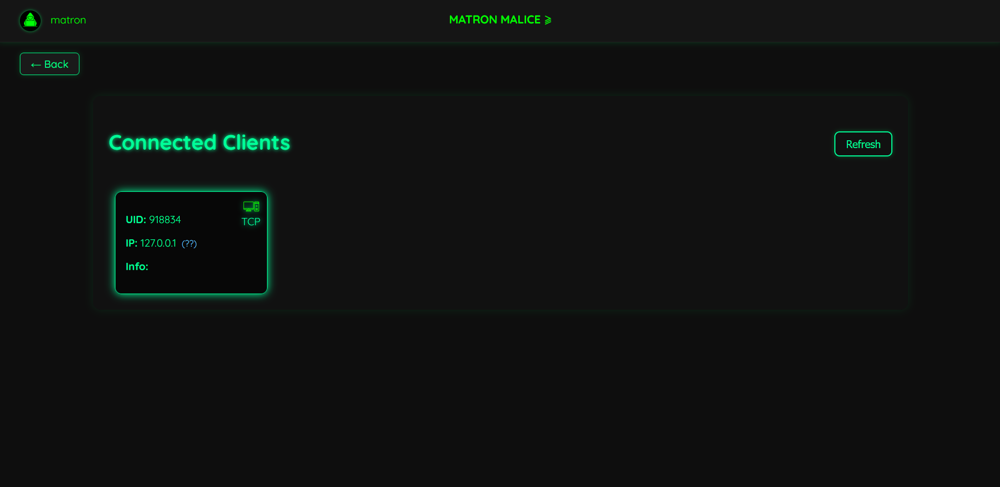

# Matron-Malice

**Matron-Malice** is a fully-fledged, multi-user WebGUI-based security research tool designed for efficient management of callback connection shells. It provides a unified interface for post-exploitation activities, payload generation, session tracking, and collaborative reporting.

> 🚧 This project is currently under development and not yet publicly released.

## Features

- 🔄 **Multi-user Web GUI** – Real-time shell management in a collaborative environment.
- 🧠 **Integrated Servers** – Seamless setup and control of backend listeners and staging environments.
- 🧰 **Post-Exploitation Modules** – Run built-in or custom modules for in-depth system interaction after initial access.
- 🎯 **Payload Generator** – Create and deploy cross-platform payloads for various targets and protocols.
- 📋 **Reporting Engine** – Generate detailed session logs and activity reports for audits or research records.
- ⚙️ **Session & Callback Management** – View, tag, and interact with active or historical connections from a central hub.
- 🔒 **Security-Focused Design** – Built with research and red teaming in mind.

## Use Cases

- Red teaming operations
- Post-exploitation research and automation
- Payload delivery and callback tracking
- Collaborative C2-like session management

## Getting Started

> 📌 Installation instructions and setup guide will be available upon public release.

Once released, you will be able to:

1. Clone the repository
2. Install dependencies
3. Launch the WebGUI server
4. Start managing callback shells and deploying modules

## Screenshots

## Roadmap

- [x] Core WebGUI prototype
- [x] Session manager with shell interaction
- [x] Authentication & RBAC (Role-Based Access Control)
- [ ] Payload customization wizard
- [ ] Reporting and export engine

## Contributing

We’re working on an open contribution model. Guidelines and issue tracking will be available after the initial release. If you’re interested in collaborating early, feel free to reach out.

## Disclaimer

**Matron-Malice** is intended for legal security research and educational purposes only. Unauthorized use of this tool against targets without explicit permission is strictly prohibited.
